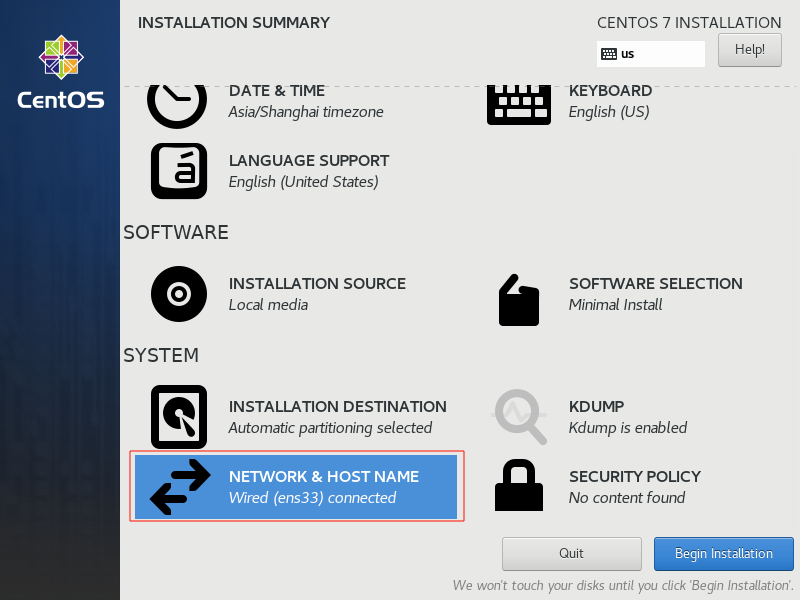
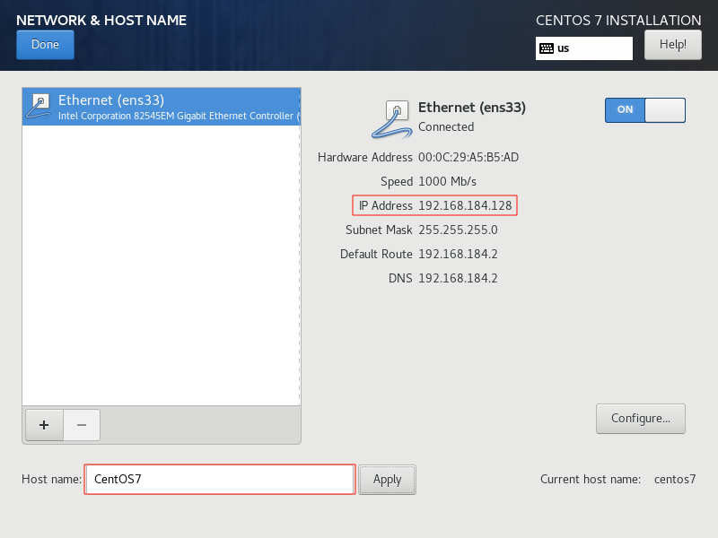
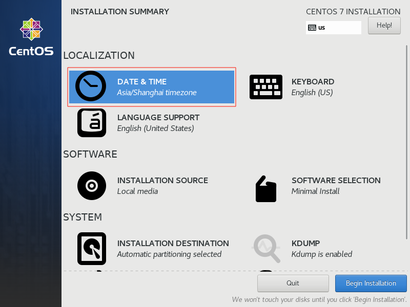
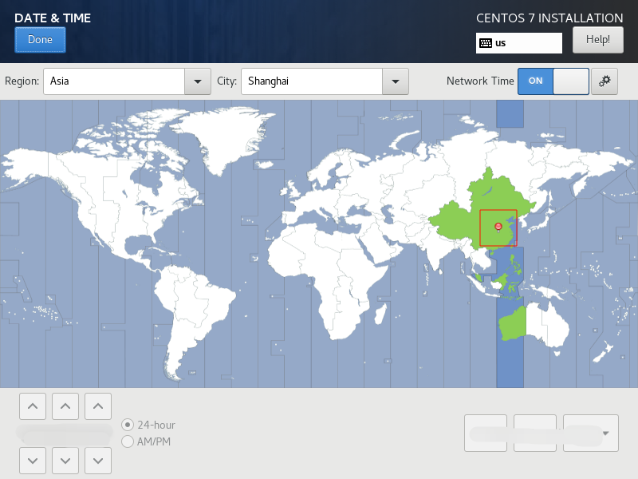

# CentOS7

## 安装

### Minimal

#### 网络配置:

- 修改主机名称为 `CentOS7`
- 获取主机 IP `192.168.184.128`




#### 时间配置:




#### 其他默认

安装过程中设置 `root` 账户密码

## 配置静态 IP

```shell
# 确认网卡名称: ens33
ip addr
# 修改 UUID
sed -i "/UUID/c UUID=$(uuidgen)" /etc/sysconfig/network-scripts/ifcfg-ens33
# 修改使用静态 IP
sed -i "/BOOTPROTO/c BOOTPROTO=static" /etc/sysconfig/network-scripts/ifcfg-ens33
# 新增静态 IP
sed -i '$ a\IPADDR=192.168.184.6' /etc/sysconfig/network-scripts/ifcfg-ens33
# 新增子网掩码
sed -i '$ a\NETMASK=255.255.255.0' /etc/sysconfig/network-scripts/ifcfg-ens33
# 新增网关 IP
sed -i '$ a\GATEWAY=192.168.184.2' /etc/sysconfig/network-scripts/ifcfg-ens33
# 新增 DNS
sed -i '$ a\DNS1=8.8.8.8' /etc/sysconfig/network-scripts/ifcfg-ens33
# 重启网络
service network restart
```

## 防火墙

```shell
# 查看防火墙状态
systemctl status firewalld
# 关闭防火墙
systemctl stop firewalld
# 禁止开机启动防火墙
systemctl disable firewalld
```

## 换源
```shell
vi /etc/yum.repos.d/CentOS-Base.repo
```

```plantuml
# CentOS-Base.repo
#
# The mirror system uses the connecting IP address of the client and the
# update status of each mirror to pick mirrors that are updated to and
# geographically close to the client.  You should use this for CentOS updates
# unless you are manually picking other mirrors.
#
# If the mirrorlist= does not work for you, as a fall back you can try the 
# remarked out baseurl= line instead.
#
#
 
[base]
name=CentOS-$releasever - Base - mirrors.aliyun.com
failovermethod=priority
baseurl=http://mirrors.aliyun.com/centos/$releasever/os/$basearch/
        http://mirrors.aliyuncs.com/centos/$releasever/os/$basearch/
        http://mirrors.cloud.aliyuncs.com/centos/$releasever/os/$basearch/
gpgcheck=1
gpgkey=http://mirrors.aliyun.com/centos/RPM-GPG-KEY-CentOS-7
 
#released updates 
[updates]
name=CentOS-$releasever - Updates - mirrors.aliyun.com
failovermethod=priority
baseurl=http://mirrors.aliyun.com/centos/$releasever/updates/$basearch/
        http://mirrors.aliyuncs.com/centos/$releasever/updates/$basearch/
        http://mirrors.cloud.aliyuncs.com/centos/$releasever/updates/$basearch/
gpgcheck=1
gpgkey=http://mirrors.aliyun.com/centos/RPM-GPG-KEY-CentOS-7
 
#additional packages that may be useful
[extras]
name=CentOS-$releasever - Extras - mirrors.aliyun.com
failovermethod=priority
baseurl=http://mirrors.aliyun.com/centos/$releasever/extras/$basearch/
        http://mirrors.aliyuncs.com/centos/$releasever/extras/$basearch/
        http://mirrors.cloud.aliyuncs.com/centos/$releasever/extras/$basearch/
gpgcheck=1
gpgkey=http://mirrors.aliyun.com/centos/RPM-GPG-KEY-CentOS-7
 
#additional packages that extend functionality of existing packages
[centosplus]
name=CentOS-$releasever - Plus - mirrors.aliyun.com
failovermethod=priority
baseurl=http://mirrors.aliyun.com/centos/$releasever/centosplus/$basearch/
        http://mirrors.aliyuncs.com/centos/$releasever/centosplus/$basearch/
        http://mirrors.cloud.aliyuncs.com/centos/$releasever/centosplus/$basearch/
gpgcheck=1
enabled=0
gpgkey=http://mirrors.aliyun.com/centos/RPM-GPG-KEY-CentOS-7
 
#contrib - packages by Centos Users
[contrib]
name=CentOS-$releasever - Contrib - mirrors.aliyun.com
failovermethod=priority
baseurl=http://mirrors.aliyun.com/centos/$releasever/contrib/$basearch/
        http://mirrors.aliyuncs.com/centos/$releasever/contrib/$basearch/
        http://mirrors.cloud.aliyuncs.com/centos/$releasever/contrib/$basearch/
gpgcheck=1
enabled=0
gpgkey=http://mirrors.aliyun.com/centos/RPM-GPG-KEY-CentOS-7
```
