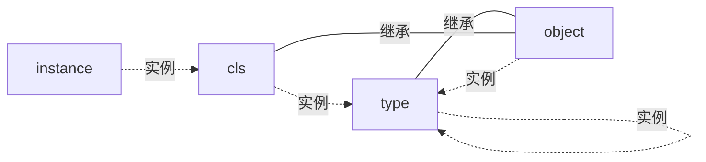

# python 核心技术

## 一切皆对象

- object 是所有类(含 type, 但不含 object)的基类
- 所有类(含 object 与 type)均是 type 类的实例

<<< @/../../../../scripts/python/advanced/obj.py

## 魔法函数

### \_\_getitem__

<<< @/../../../../scripts/python/advanced/obj_getitem.py

### \_\_repr__ 与 \_\_str__

- \_\_str__: 用于生成可读性强的字符串, 适合最终用户, 通常用于 print() 函数和用户界面
- \_\_repr__: 用于生成精确的字符串, 适合调试和开发, 通常用于 repr() 函数和调试工具
- 如果没有定义 \_\_str__ 方法, Python 会默认使用 \_\_repr__ 方法

<<< @/../../../../scripts/python/advanced/obj_str_repr.py

### \_\_getattr__ 与 \_\_getattribute__

- \_\_getattr__: 找不到属性时调用
- \_\_getattribute__: 任何属性都会走这个方法, 找不到时抛出 `AttributeError` 后会调用 \_\_getattr__

<<< @/../../../../scripts/python/advanced/obj_getattr_getattribute.py
