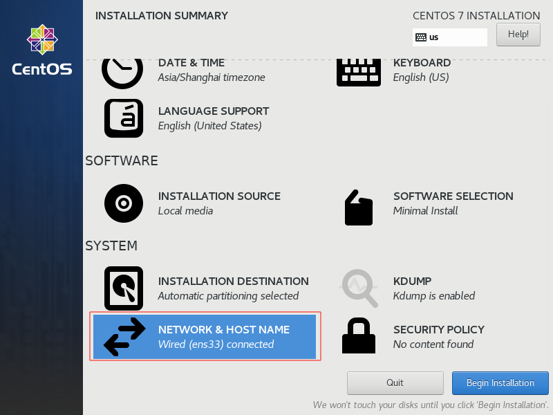
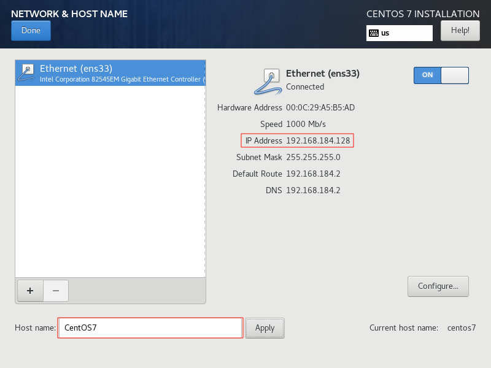
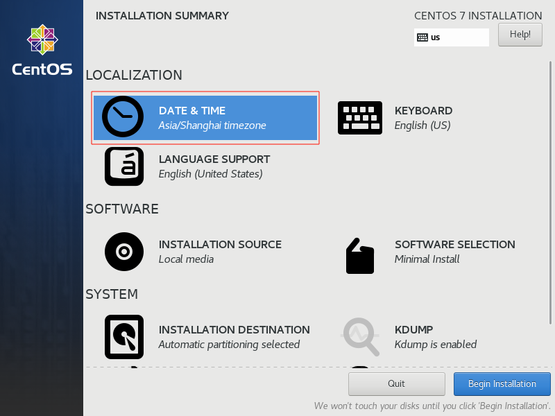
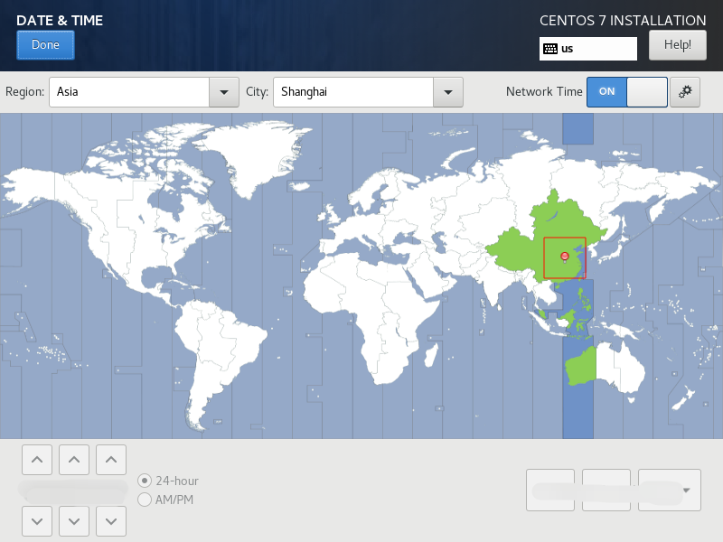

# CentOS7

## 安装

### Minimal

#### 网络配置:

- 修改主机名称为 `CentOS7`
- 获取主机 IP `192.168.184.128`




#### 时间配置:




#### 其他默认

安装过程中设置 `root` 账户密码

## 配置静态 IP

```shell
# 确认网卡名称: ens33
ip addr
# 修改 UUID
sed -i "/UUID/c UUID=$(uuidgen)" /etc/sysconfig/network-scripts/ifcfg-ens33
# 修改使用静态 IP
sed -i "/BOOTPROTO/c BOOTPROTO=static" /etc/sysconfig/network-scripts/ifcfg-ens33
# 新增静态 IP
sed -i '$ a\IPADDR=192.168.184.6' /etc/sysconfig/network-scripts/ifcfg-ens33
# 新增子网掩码
sed -i '$ a\NETMASK=255.255.255.0' /etc/sysconfig/network-scripts/ifcfg-ens33
# 新增网关 IP
sed -i '$ a\GATEWAY=192.168.184.2' /etc/sysconfig/network-scripts/ifcfg-ens33
# 新增 DNS
sed -i '$ a\DNS1=8.8.8.8' /etc/sysconfig/network-scripts/ifcfg-ens33
# 重启网络
service network restart
```

## 防火墙

```shell
# 查看防火墙状态
systemctl status firewalld
# 关闭防火墙
systemctl stop firewalld
# 禁止开机启动防火墙
systemctl disable firewalld
```
