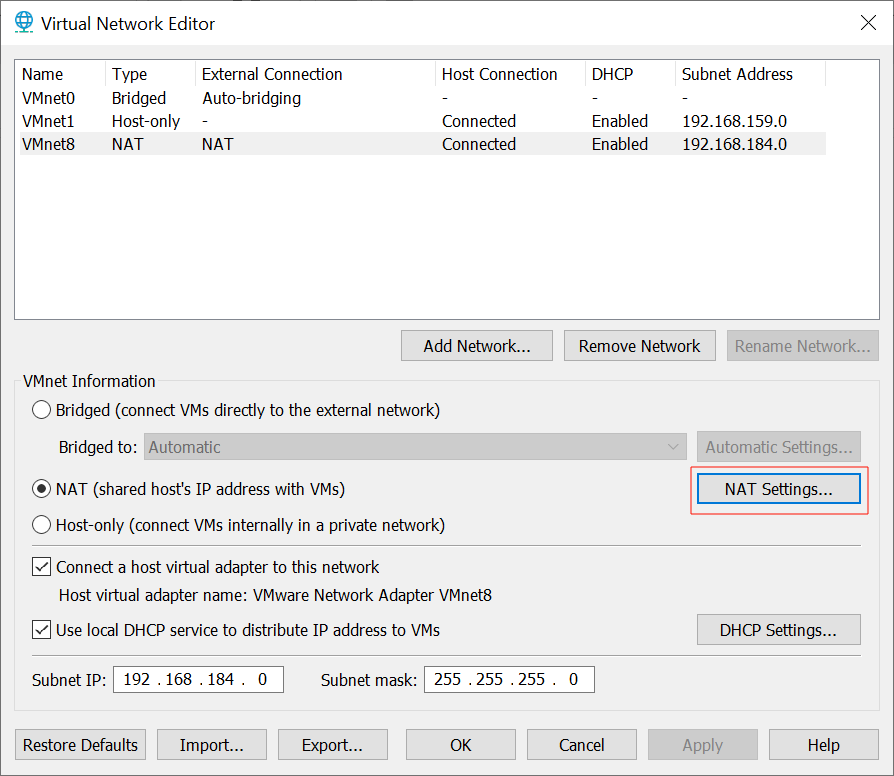
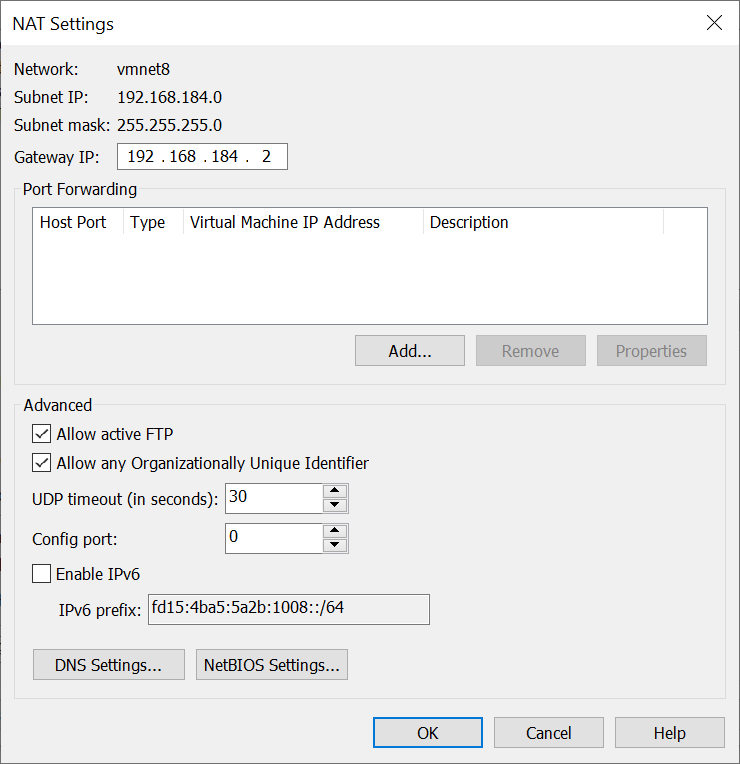

# linux

## VMware

### 网络配置

#### NAT

- 子网 IP: 192.168.184.0
- 子网掩码: 255.255.255.0
- 网关 IP: 192.168.184.2




## 操作命令

```shell
# 重启
reboot
# 重启网络
service network restart
# 修改主机名称, 重启生效
sed -i "/$(hostname)/c new name" /etc/hostname
# 修改用户 user 的密码
passwd user
# 切换 user 账户
su - user

# 查看系统用户
# root:x:0:0:root:/root:/bin/bash
# 用过户名:密码:用户ID:组ID:描述信息:HOME目录:执行终端
getent passwd

# 查看系统组
# root:x:0:
# 组名称:认证:组ID
getent group

# 添加用户 user
# 同时新增组 user
useradd user

# 修改文件归属
# 递归修改 directory 目录归于用户 user 与组 user 
chown -R user:user directory
```
