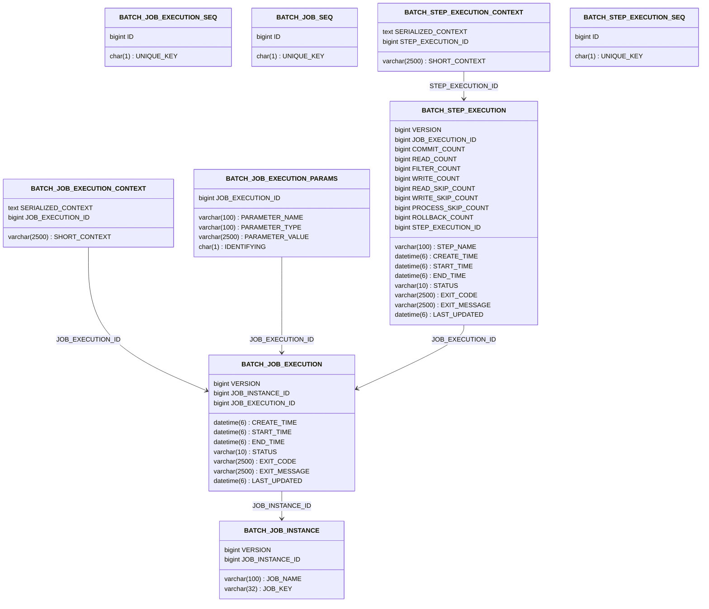

# spring-batch

## 概述

### domain model


### relational model



## 搭建环境

- 确保数据库 `batch` 已存在
- `spring.batch.jdbc.initialize-schema=always`: 表不存在则创建表

```properties
spring.datasource.driverClassName=com.mysql.cj.jdbc.Driver
spring.datasource.url=jdbc:mysql://localhost:3306/batch
spring.datasource.username=root
spring.datasource.password=root
spring.batch.jdbc.initialize-schema=always
```
